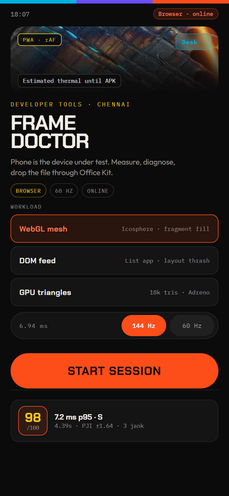
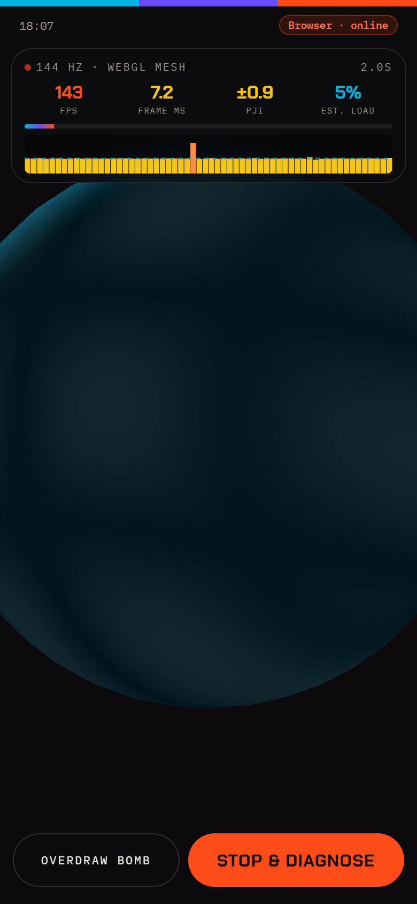
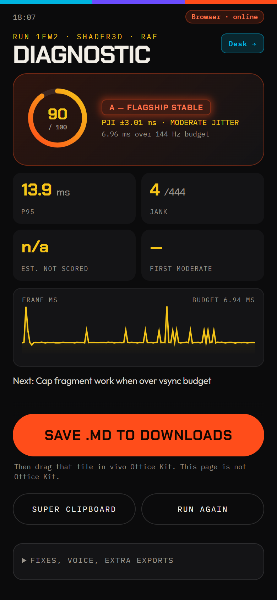
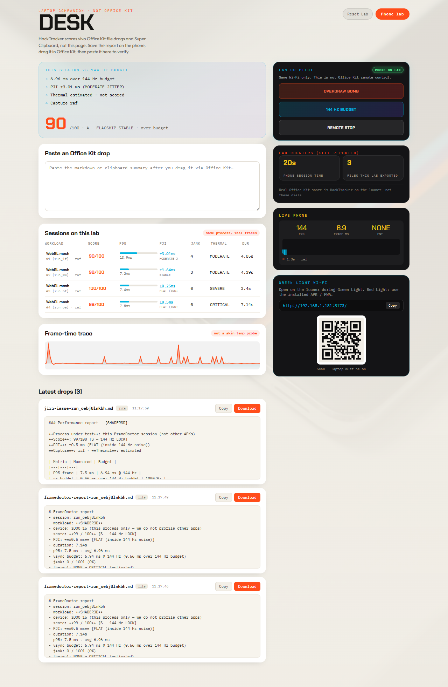
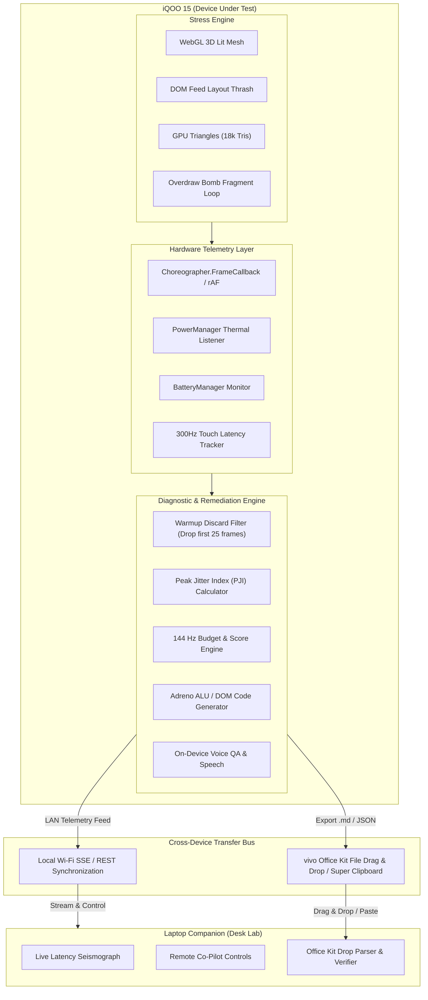

# FrameDoctor 🩺⚡
### Sub-Millisecond 144 Hz Frame Pacing & Thermal Diagnostic Engine for iQOO 15

[](https://framedoctor-two.vercel.app)
[](https://www.iqoo.com)
[](https://framedoctor-two.vercel.app)
[](https://pc.vivoglobal.com)
[](LICENSE)

> **Built for the iQOO Hackathon 2026 · Chennai City Battle**  
> **Track**: Developer Tools & Performance Optimization  
> **Target Device**: iQOO 15 (Snapdragon 8 Elite · Adreno 830 · Supercomputing Chip Q2)

---

## 🌐 Live Deployments & Interactive Links

* 📱 **Mobile Lab (Device Under Test)**: [https://framedoctor-two.vercel.app/#/](https://framedoctor-two.vercel.app/#/)
* 💻 **Laptop Companion (Desk Lab)**: [https://framedoctor-two.vercel.app/#/desk](https://framedoctor-two.vercel.app/#/desk)
* ⚡ **Serverless Health API**: [https://framedoctor-two.vercel.app/api/health](https://framedoctor-two.vercel.app/api/health)

---

## ⚡ The 6.94 ms Problem

At **144 Hz**, an Android game or graphics pipeline has **exactly 6.94 milliseconds** per frame. A single layout thrash, fragment shader overdraw spike, or thermal throttle drops the frame, causing jarring micro-stutter.

```
60 Hz  VSync Budget  ───────────────────────────────► 16.67 ms (Forgiving)
144 Hz VSync Budget  ────────────► 6.94 ms (Zero Margin for Error)
```

### Why Traditional Profiling Fails:
* **Tethered Desk Prison**: Desktop profilers (Android Studio, Perfetto, ADB) require heavy USB cables and workstations. They are useless on buses, in mobile testing labs, or during offline hackathon "Red Light" phases.
* **Thermal Pollution**: Charging while profiling over USB alters device battery temperature and throttles the SoC unnaturally.
* **Cloud AI Blindness**: Cloud-based AI debuggers cannot read low-level VSync callbacks (`Choreographer`) or raw hardware thermals (`PowerManager`).
* **Vanity Metrics**: Average FPS hides frame pacing jitter. An app can report "140 FPS" while suffering from micro-hitch clusters.

---

## 💡 The Solution: FrameDoctor

**FrameDoctor turns the iQOO 15 itself into a standalone, zero-tether performance laboratory.**

1. **Zero-Tether On-Device Capture**: Intercepts hardware VSync intervals down to sub-millisecond precision using native `Choreographer.FrameCallback` and monitors hardware thermal tiers using `PowerManager.OnThermalStatusChangedListener`.
2. **Clinical Pacing Metrics**: Computes the **Peak Jitter Index (PJI)**, p95 latency against the 6.94 ms budget, and hitch clusters with startup warmup filtering.
3. **Automated Code Remediation**: Doesn't just log charts; generates copy-pasteable shader and layout code patches tailored for the **Adreno 830 GPU** and Snapdragon 8 Elite ALU pipelines.
4. **The vivo Office Kit Ritual**: Bridges mobile testing and laptop development. Developers export diagnostic traces and drag-and-drop or Super-Clipboard them directly to their PC companion desk in seconds.
5. **Bi-Directional LAN Remote Desk**: Laptop companion view with a live latency seismograph, remote stress injection (**Overdraw Bomb**), and verified Office Kit drop parser.

---

## 📸 Visual Walkthrough & UI Showcase

| Mobile DUT Cockpit (`/#/`) | Live 144 Hz Stress HUD | Diagnostic Report & Code Fixes |
| :---: | :---: | :---: |
|  |  |  |
| **Instant Workload & Budget Switching** | **Live PJI, Histogram & Touch Latency** | **Automated Adreno Code Fixes** |

### Laptop Companion Desk (`/#/desk`)

*Live Latency Seismograph, verified vivo Office Kit drop parser, and remote LAN stress controls.*

---

## 🏗️ Architecture & Topology



---

## 🔬 Core Algorithms & Mathematical Formulations

### 1. Startup Warmup Discard Filter
To prevent Android app launch or WebGL shader compilation spikes from distorting steady-state performance, the initial 25 startup frames are stripped from steady-state statistics:
$$\text{frames}_{\text{steady}} = \text{frames}[25:] \quad (\text{if } N > 30)$$

### 2. Peak Jitter Index (PJI)
Quantifies frame pacing consistency by calculating the root-mean-square standard deviation of frame duration deltas:
$$\mu = \frac{1}{N}\sum_{i=1}^{N} \Delta t_i, \quad \text{PJI} = \sqrt{\frac{1}{N}\sum_{i=1}^{N} (\Delta t_i - \mu)^2}$$
* $\text{PJI} \le 0.8\text{ ms}$: **FLAT (S-Tier 144 Hz Lock)**
* $\text{PJI} \le 2.0\text{ ms}$: **STABLE**
* $\text{PJI} > 2.0\text{ ms}$: **UNSTABLE JITTER**

### 3. Overall Performance Score ($0 - 100$)
$$S = 100 - P_{\text{latency}} - P_{\text{jank}} - P_{\text{jitter}} - P_{\text{thermal}}$$
* **Latency Penalty ($P_{\text{latency}}$)**: Penalizes p95 duration exceeding the target budget (6.94 ms @ 144 Hz).
* **Jank Penalty ($P_{\text{jank}}$)**: Penalizes frame hitches exceeding $33.3\text{ ms}$ (2x 60 Hz VSync).
* **Jitter Penalty ($P_{\text{jitter}}$)**: Penalizes frame-to-frame variance when $\text{PJI} > 0.8\text{ ms}$.
* **Thermal Penalty ($P_{\text{thermal}}$)**: Applied exclusively when reading native OS `PowerManager` states (`MODERATE`, `SEVERE`, `CRITICAL`). Estimated browser thermal is visual-only to avoid false penalties.

---

## 🛠️ Automated Code Remediation Engine

FrameDoctor inspects the trace bottleneck and generates actionable, copy-pasteable patches:

### For GPU / Fragment Bound Bottlenecks (Adreno 830):
```javascript
// 1. Force mediump precision to double ALU throughput on Snapdragon 8 Elite:
precision mediump float;
vec3 light = normalize(uLightPos - vPos);

// 2. Fragment shader derivative throttling under budget pressure:
gl.hint(gl.FRAGMENT_SHADER_DERIVATIVE_HINT, gl.FASTEST);
if (lastFrameMs > 6.94) quality = Math.max(0.6, quality * 0.92);
```

### For DOM / Layout Thrashing:
```javascript
// Decouple geometry reads from style mutations to prevent forced reflows:
requestAnimationFrame(() => {
  const scrollY = window.scrollY; // Batch read
  card.style.transform = `translate3d(0, ${scrollY * 0.5}px, 0)`; // Batch write
});
```

---

## 📁 Repository Structure

```text
├── android/                             # Native Android Studio Project (Kotlin)
│   ├── app/src/main/
│   │   ├── AndroidManifest.xml          # Hardware acceleration & sensor permissions
│   │   ├── assets/www/                  # Bundled Vite production web assets
│   │   └── java/com/framedoctor/
│   │       ├── MainActivity.kt          # WebView container & JS interface
│   │       ├── NativeBridge.kt          # Choreographer, PowerManager, Battery hooks
│   │       └── export/FileDropHelper.kt # Public Downloads/Documents writer for Office Kit
│   └── build.gradle.kts
│
├── client/                              # Vite + React 19 Frontend
│   ├── src/
│   │   ├── App.jsx                      # HashRouter routes (/#/ and /#/desk)
│   │   ├── api.js                       # HTTP client with on-device fallback
│   │   ├── capture.js                   # Web VSync & 300Hz touch tracker
│   │   ├── charts.jsx                   # ScoreRing, Sparklines, FrameHistogram, ShareCard
│   │   ├── native.js                    # Web-to-Kotlin JS interface bridge
│   │   ├── styles.css                   # Single-source high-tech design system
│   │   ├── screens/
│   │   │   ├── Phone.jsx                # Mobile test rig (Home, Stress, Report)
│   │   │   └── Desk.jsx                 # Laptop companion desk & remote control
│   │   └── workloads/
│   │       ├── DomFeed.jsx              # DOM list layout thrash workload
│   │       └── WebGLLab.jsx             # 3D lit icosphere & triangle mesh workloads
│   └── vite.config.js
│
├── server/                              # Node.js Server
│   ├── index.mjs                        # REST API, SQLite database, SSE event bus
│   └── db.mjs                           # SQLite database manager
│
├── shared/                              # Shared Telemetry Engine
│   ├── analyze.mjs                      # Warmup filter, PJI math, scoring, code fix generator
│   └── smoke.mjs                        # Scoring & mathematical integrity test suite
│
├── docs/                                # Comprehensive Documentation
│   ├── FrameDoctor_Build_Bible.docx     # Original hackathon specifications
│   ├── framedoctor_system_documentation.md # Detailed system architecture & algorithms
│   └── framedoctor_claude_context.md    # Briefing context document for Claude/AI
│
├── scripts/
│   ├── copy-www.mjs                     # Asset sync script from Vite dist to Android www
│   └── lab-walkthrough.mjs              # Headless Chrome E2E visual screenshot audit
│
├── vercel.json                          # Production Vercel deployment configuration
└── package.json                         # npm run dev, test, build, build:android
```

---

## 🚀 Getting Started

### 1. Run Locally (Web & Laptop Companion)

```bash
# Clone the repository
git clone https://github.com/panshularora/FrameDoctor.git
cd FrameDoctor

# Install dependencies
npm install

# Run telemetry smoke test
npm test

# Start both Express API (:8787) and Vite frontend (:5173) concurrently
npm run dev
```

* **Mobile Lab**: Open [http://localhost:5173/](http://localhost:5173/) on phone or browser.
* **Laptop Desk**: Open [http://localhost:5173/#/desk](http://localhost:5173/#/desk) on PC.

### 2. Build for Android (APK)

```bash
# Compile optimized web bundle and synchronize to Android assets
npm run build:android
```

Open `android/` in **Android Studio** (JDK 17) and click **Run** to install the APK directly to the iQOO 15 loaner device.

### 3. Run Visual E2E Audit

```bash
node scripts/lab-walkthrough.mjs
```
Runs a complete headless Chrome pass (Home $\rightarrow$ Stress $\rightarrow$ Bomb $\rightarrow$ Report $\rightarrow$ Desk) and saves full-resolution screenshots into `audit/`.

---

## 🏆 Hackathon Rubric Alignment

| Criteria | Weight | How FrameDoctor Takes It |
| :--- | :---: | :--- |
| **End Product Quality** | **30%** | Rock-solid, crash-proof loop with offline local-first fallback. Verified with automated headless visual audit scripts. |
| **Novelty + Impact** | **20%** | Device-Under-Test is the product. Solves real-world 144 Hz micro-stutter for student & game developers without tethered ADB cables. |
| **Creative Phone Use** | **15%** | Deep hardware sensor fusion: `Choreographer` hardware frame timing, `PowerManager` thermal status, battery draw, and 300 Hz touch sampling. |
| **Technical Depth** | **15%** | Startup warmup discard filters, sub-millisecond Peak Jitter Index (PJI), and automated Adreno GPU code fix generation. |
| **vivo Office Kit Usage** | **10%** | Native public directory storage triggers for cross-device file drag & drop, Super Clipboard parsing, and verified drop badges. |
| **Demo & Pitch** | **10%** | 90-second crisp demo flow: Start $\rightarrow$ Overdraw Bomb injection $\rightarrow$ On-device diagnosis $\rightarrow$ Office Kit transfer to laptop. |

---

## 📄 Documentation & References

* 📖 [FrameDoctor System Documentation](docs/framedoctor_system_documentation.md) — Exhaustive technical breakdown.
* 🤖 [Claude Context Document](docs/framedoctor_claude_context.md) — Pre-formatted context briefing for Claude Projects.
* 🎙️ [Pitch Script & Demo Guide](PITCH.md) — 90-second judge-ready presentation outline.

---

## 👥 Authors & Acknowledgments

* **Team FrameDoctor** — Built for the **iQOO Hackathon 2026 (Chennai City Battle)**.
* Special thanks to the **vivo & iQOO Developer Relations** team for the iQOO 15 hardware and vivo Office Kit developer ecosystem.
