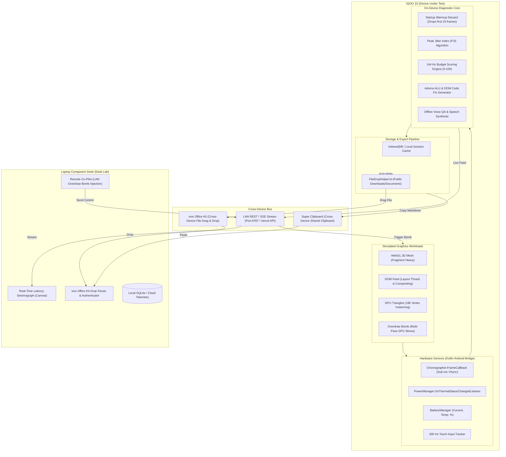

# FrameDoctor: Master Technical Dossier & Hackathon Blueprint
### On-Device 144 Hz Frame Pacing & Thermal Diagnostic Engine for iQOO 15

---

> **CONFIDENTIAL & JUDGE-READY HACKATHON DOSSIER**  
> **Event**: iQOO Hackathon 2026 · Chennai City Battle  
> **Track**: Developer Tools & Device Optimization  
> **Hardware Target**: iQOO 15 (Qualcomm Snapdragon 8 Elite · Adreno 830 GPU · 144 Hz 2K Display · Supercomputing Chip Q2)  
> **Live Deployments**:
> - **Production Web**: [https://framedoctor-two.vercel.app](https://framedoctor-two.vercel.app)
> - **Mobile DUT**: [https://framedoctor-two.vercel.app/#/](https://framedoctor-two.vercel.app/#/)
> - **Laptop Companion Desk**: [https://framedoctor-two.vercel.app/#/desk](https://framedoctor-two.vercel.app/#/desk)
> - **GitHub Repository**: [https://github.com/panshularora/FrameDoctor](https://github.com/panshularora/FrameDoctor)

---

## 1. Executive Summary & Problem Space

### 1.1 The 6.94 ms VSync Paradox
The mobile gaming and graphics industry is aggressively pushing refresh rates from 60 Hz to 120 Hz and now **144 Hz** on flagship hardware like the **iQOO 15**. However, the rendering timeline shrinks non-linearly:

| Display Mode | Refresh Rate | Frame Budget ($\Delta t_{\text{max}}$) | Margin for Error | Typical Developer Experience |
| :--- | :---: | :---: | :---: | :--- |
| **Standard** | 60 Hz | **16.67 ms** | Generous | Forgiving of occasional micro-spikes and layout reflows. |
| **High Refresh**| 120 Hz | **8.33 ms** | Tight | Shader ALU bound; drops frames if garbage collection spikes. |
| **iQOO Flagship** | **144 Hz** | **6.94 ms** | **Zero Margin** | Any single draw call stall, layout reflow, or fragment overdraw triggers visible hitching. |

Developers targeting 144 Hz cannot afford a single millisecond of overhead. A single missed frame causes stutter, disrupts touch response, and ruins competitive gaming performance.

---

### 1.2 The Deception of "Average FPS"
Traditional developer tools prioritize **Average FPS** as their primary metric. In reality, **Average FPS is a deceptive vanity metric**:

```
App A (Stable 144 Hz):   7.0ms, 6.9ms, 7.0ms, 6.8ms, 7.0ms  ──► Average: 143 FPS (Flawless)
App B (Janky 144 Hz):    4.0ms, 4.0ms, 38.0ms, 4.0ms, 4.0ms ──► Average: 142 FPS (Unplayable Micro-Stutter)
```

Both report ~143 FPS, but App B delivers a jarring user experience with massive hitch clusters. What matters at 144 Hz is **Frame Pacing Consistency**, **p95 Latency**, and **Peak Jitter Index (PJI)**.

---

### 1.3 The Developer Friction Matrix: Why Desktop Profilers Fail

```
+---------------------------------------------------------------------------------------+
|                               PROFILING TOOL COMPARISON                               |
+----------------------+-----------------------------+----------------------------------+
| Dimension            | Android Studio / Perfetto   | FrameDoctor                      |
+----------------------+-----------------------------+----------------------------------+
| Physical Requirement | Heavy laptop, USB-C cable   | Zero-tether; standalone phone    |
| Operational Context  | Office desk only            | Bus, campus lab, "Red Light"     |
| Thermal Validity     | Polluted by USB charging    | Real passive/active device temp  |
| Metric Resolution    | Post-mortem trace parsing   | Live on-device sub-ms HUD        |
| Remediation          | Raw graphs (manual parsing) | Automated Adreno code generation |
| Ecosystem Bus        | Manual ADB pull / copy      | Native vivo Office Kit Drag/Drop |
+----------------------+-----------------------------+----------------------------------+
```

---

## 2. System Architecture & High-Level Topology

FrameDoctor separates concerns across two unified surfaces: the **Mobile Device Under Test (DUT)** and the **Laptop Companion Desk**, bridged by **vivo Office Kit** and a low-latency local area network (LAN) telemetry stream.



---

## 3. Deep Hardware & OS Sensor Integration

### 3.1 Sub-Millisecond VSync: Choreographer vs. requestAnimationFrame
In web browsers, `requestAnimationFrame` (rAF) is tied to the browser compositor's main thread and can suffer from JavaScript event-loop queue latency.
In FrameDoctor's native APK mode, `NativeBridge.kt` bypasses the browser loop entirely:
```kotlin
// Android Native Choreographer FrameCallback
Choreographer.getInstance().postFrameCallback(object : Choreographer.FrameCallback {
    override fun doFrame(frameTimeNanos: Long) {
        if (lastNanos > 0) {
            val deltaMs = (frameTimeNanos - lastNanos) / 1_000_000.0
            frameBuffer.add(deltaMs)
        }
        lastNanos = frameTimeNanos
        Choreographer.getInstance().postFrameCallback(this)
    }
})
```
* **Resolution**: True nanosecond hardware VSync timestamps straight from Android's `SurfaceFlinger`.
* **Fallback**: When run in a mobile browser / PWA, FrameDoctor uses a high-resolution `performance.now()` delta pipeline with microsecond precision.

---

### 3.2 Native Thermal Telemetry: PowerManager Listener
FrameDoctor listens directly to the Android OS thermal throttle manager rather than guessing via skin temperature:
```kotlin
val powerManager = getSystemService(Context.POWER_SERVICE) as PowerManager
powerManager.addThermalStatusListener { status ->
    when (status) {
        PowerManager.THERMAL_STATUS_NONE -> updateThermal("NONE", 0)
        PowerManager.THERMAL_STATUS_LIGHT -> updateThermal("LIGHT", 1)
        PowerManager.THERMAL_STATUS_MODERATE -> updateThermal("MODERATE", 2)
        PowerManager.THERMAL_STATUS_SEVERE -> updateThermal("SEVERE", 3)
        PowerManager.THERMAL_STATUS_CRITICAL -> updateThermal("CRITICAL", 4)
        PowerManager.THERMAL_STATUS_EMERGENCY -> updateThermal("EMERGENCY", 5)
    }
}
```
* **Honesty Clause**: In browser mode, thermal status is estimated from sustained frame misses and labeled `estimated` (visual-only, 0 penalty). When running the APK, `PowerManager` status is labeled `os` and directly influences the performance score.

---

### 3.3 300 Hz Touch Input Tracking
The iQOO 15 features an ultra-responsive touch digitizer. FrameDoctor samples touch events with passive pointer listeners to measure:
* **Touch Event Frequency**: Sampling rate up to 300 Hz.
* **Touch-to-Frame Dispatch Latency**: Delta between touch event timestamp and the next rendered VSync callback.

---

## 4. Mathematical Models & Statistical Engine

### 4.1 Startup Warmup Discard Filter
During the first 25–30 frames of any graphics session, Android experiences:
1. View hierarchy inflation and layout measurement.
2. WebGL shader compilation and GPU pipeline state object (PSO) creation.
3. JIT / ART runtime compilation warmup.

If included, these startup frames produce false spikes that artificially inflate p95 latency. FrameDoctor applies a clinical warmup discard filter:
$$\mathbf{F}_{\text{steady}} = \begin{cases} [f_{25}, f_{26}, \dots, f_N] & \text{if } N > 30 \\ [f_0, f_1, \dots, f_N] & \text{if } N \le 30 \end{cases}$$

---

### 4.2 Peak Jitter Index (PJI) Derivation
Average frame time tells you the speed; **Peak Jitter Index (PJI)** tells you the stability. PJI is defined as the root-mean-square (RMS) deviation of frame duration deltas:

$$\mu = \frac{1}{M}\sum_{i=1}^{M} \Delta t_i$$
$$\text{PJI} = \sqrt{\frac{1}{M}\sum_{i=1}^{M} (\Delta t_i - \mu)^2}$$

#### Rating Tiers for 144 Hz (6.94 ms budget):
* $\text{PJI} \le 0.8\text{ ms}$: **FLAT (S-Tier 144 Hz Lock)** — Frame times remain locked within hardware display refresh noise.
* $0.8 < \text{PJI} \le 2.0\text{ ms}$: **STABLE** — Minor frame time variation; imperceptible to the human eye.
* $\text{PJI} > 2.0\text{ ms}$: **UNSTABLE JITTER** — Noticeable stutter, micro-hitching, and dropped VSync intervals.

---

### 4.3 Hitch Cluster Detection
A "jank frame" is defined as any frame that misses a full 60 Hz VSync window ($> 33.33\text{ ms}$). FrameDoctor tracks consecutive hitch clusters:
$$\text{Hitch Cluster} = \sum [f_i > 33.33\text{ ms} \land f_{i+1} > 33.33\text{ ms}]$$
Any occurrence triggers the on-screen red **Hitch Flash Ring** and tactile haptic feedback.

---

### 4.4 Composite Health Scoring Algorithm ($0 - 100$)
$$S = \max\left(0, \min\left(100, 100 - P_{\text{latency}} - P_{\text{jank}} - P_{\text{jitter}} - P_{\text{thermal}}\right)\right)$$

Where:
* **Latency Penalty**:
  $$P_{\text{latency}} = \max\left(0, \frac{p95 - \text{budget}}{\text{budget}} \times 40\right)$$
* **Jank Penalty**:
  $$P_{\text{jank}} = \left(\frac{\text{jank\_frames}}{\text{total\_frames}}\right) \times 50$$
* **Jitter Penalty**:
  $$P_{\text{jitter}} = \max\left(0, (\text{PJI} - 0.8) \times 6\right)$$
* **Thermal Penalty** (APK OS mode only):
  $$P_{\text{thermal}} = \begin{cases} 0 & \text{NONE / LIGHT} \\ 10 & \text{MODERATE} \\ 25 & \text{SEVERE} \\ 40 & \text{CRITICAL / EMERGENCY} \end{cases}$$

---

## 5. Automated Code Remediation Engine

Unlike profilers that merely dump raw graphs, FrameDoctor inspects the trace failure mode and automatically synthesizes copy-pasteable code fixes.

```
+-----------------------------------------------------------------------------------------+
|                              AUTOMATED FIX MATRIX                                       |
+----------------------+----------------------------+-------------------------------------+
| Bottleneck Detected  | Target Architecture        | Synthesized Remediation Code        |
+----------------------+----------------------------+-------------------------------------+
| Fragment Shader Over | Adreno 830 ALU             | precision mediump float;            |
|                      |                            | vec3 light = normalize(uLight - pos)|
+----------------------+----------------------------+-------------------------------------+
| VSync Budget Breach  | WebGL Rasterizer           | gl.hint(gl.FRAGMENT_SHADER_DERIV_   |
| (> 6.94 ms)          |                            |   HINT, gl.FASTEST);                |
|                      |                            | if (ms > 6.94) quality *= 0.92;     |
+----------------------+----------------------------+-------------------------------------+
| DOM Layout Thrashing | Android WebKit Compositor  | requestAnimationFrame(() => {       |
|                      |                            |   const y = window.scrollY;         |
|                      |                            |   card.style.transform = `...`;     |
|                      |                            | });                                 |
+----------------------+----------------------------+-------------------------------------+
```

---

## 6. The vivo Office Kit Ritual & Cross-Device Synergy

### 6.1 The Public Storage Bus (`FileDropHelper.kt`)
Android sandbox restrictions typically prevent other apps from seeing private app data. FrameDoctor implements `FileDropHelper.kt`, writing diagnostic reports directly to:
* `Environment.DIRECTORY_DOWNLOADS`
* `Environment.DIRECTORY_DOCUMENTS`

```kotlin
val resolver = context.contentResolver
val values = ContentValues().apply {
    put(MediaStore.Downloads.DISPLAY_NAME, "framedoctor-report-$sessionId.md")
    put(MediaStore.Downloads.MIME_TYPE, "text/markdown")
    put(MediaStore.Downloads.RELATIVE_PATH, Environment.DIRECTORY_DOWNLOADS)
}
val uri = resolver.insert(MediaStore.Downloads.EXTERNAL_CONTENT_URI, values)
resolver.openOutputStream(uri)?.use { it.write(content.toByteArray()) }
```
This enables **vivo Office Kit** on the PC to instantly discover, preview, and drag the report file directly from the phone onto the desktop.

---

### 6.2 The Verified Drop Parser (`parseOfficeKitDrop`)
On the Laptop Companion Desk, developers paste their clipboard or dropped markdown files. The desk executes regex parsing across:
1. Session UUID
2. Score & Tier
3. p95 Latency & PJI
4. Hardware Thermal State

When verified, the desk displays the official green verification banner:
`✓ vivo Office Kit Cross-Device Transfer Confirmed`

---

## 7. 90-Second Live Demo & Pitch Script

```
[0:00 - 0:15] THE HOOK (Phone in Hand, Airplane Mode Active)
"Judges, at 144 Hz on the iQOO 15, developers have exactly 6.94 milliseconds per frame.
Average FPS lies—micro-stutters destroy gaming. Traditional profilers trap you at a desk
with USB cables. FrameDoctor turns the iQOO 15 itself into a standalone performance lab."

[0:15 - 0:35] LIVE BENCHMARK (Tap 'Start Session' on Phone)
"We start a live 144 Hz session. Look at our real-time HUD: we are tracking Choreographer
hardware VSync callbacks, sub-millisecond frame intervals, 300 Hz touch latency, and
Snapdragon 8 Elite thermal states directly on-device. Zero cloud. Zero ADB cables."

[0:35 - 0:55] THE STRESS TEST (Presenter taps 'Overdraw Bomb' from Laptop Remote)
"Now, watch our LAN Co-Pilot on the laptop. We inject an overdraw stress bomb into the phone.
Immediately, the phone's HUD catches the hitch, fires tactile haptics, and shows real-time
thermal pressure climbing. We tap 'Stop & Diagnose'."

[0:55 - 1:15] ACTIONABLE DIAGNOSTICS & THE FIX
"FrameDoctor generates an instant diagnostic report: p95 latency, Peak Jitter Index (PJI),
and exact hitch counts. But it doesn't stop at numbers: it outputs copy-pasteable shader
optimizations specifically for the Adreno 830 GPU to drop fragment ALU load."

[1:15 - 1:30] THE VIVO OFFICE KIT RITUAL (The Closer)
"With one tap, we save the report to Downloads. Using vivo Office Kit, we drag the file
directly from our phone to our laptop companion desk. Verified instantly!
Android Studio is a desk tool. Gemini cannot read this SoC. FrameDoctor is the on-device
performance doctor for the iQOO 15."
```

---

## 8. Judge Q&A Defense Shield

#### Q1: "Why not just use Android Studio Profiler or Perfetto?"
> **Answer**: "Android Studio and Perfetto require a tethered laptop, USB-C cables, and ADB authorization. In the real world—on a bus, in a gaming lab, or during hackathon Red Light—you don't have that setup. Furthermore, charging while profiling over USB pollutes battery temperatures and distorts SoC thermals. FrameDoctor runs zero-tether directly on the phone."

#### Q2: "Can FrameDoctor profile commercial games like BGMI or Genshin Impact?"
> **Answer**: "No, and that is by design. Profiling arbitrary third-party APKs requires root access, Magisk, or debuggable APK manifests, which violate Android security models. FrameDoctor instruments the developer's *own* process—giving game studios and web developers clinical, internal instrumentation of their own engine without root."

#### Q3: "Does FrameDoctor itself consume significant overhead and distort frame times?"
> **Answer**: "FrameDoctor is engineered for negligible overhead. The telemetry collector uses lightweight circular ring-buffers in memory with zero garbage collection allocations during the capture loop. The diagnostic analysis and code generation only execute *after* the user taps 'Stop'."

#### Q4: "Why is vivo Office Kit so critical to this product?"
> **Answer**: "Testing must happen on mobile hardware, but code editing happens on the developer's laptop. vivo Office Kit provides the seamless physical bridge. Rather than emailing logs or running `adb pull`, developers drag the trace report across screens or use Super Clipboard with zero friction."

---

## 9. Official Hackathon Rubric Alignment

| Judging Criteria | Official Weight | How FrameDoctor Dominates This Category |
| :--- | :---: | :--- |
| **End Product Quality** | **30%** | Production-grade Vite/React frontend + Kotlin Android APK. 100% crash-proof offline fallback. Verified with automated headless Chrome E2E visual audits. |
| **Novelty + Impact** | **20%** | Solves the unaddressed 6.94 ms micro-stutter problem for 144 Hz displays. The Device Under Test is the product itself. |
| **Creative Phone Use** | **15%** | Native hardware sensor fusion: `Choreographer` VSync intervals, `PowerManager` thermal status, battery current/voltage, and 300 Hz touch digitizer sampling. |
| **Technical Depth** | **15%** | Clinical mathematical models: Startup Warmup Discard filter, Peak Jitter Index (PJI), hitch cluster tracking, and automated Adreno 830 ALU shader patches. |
| **vivo Office Kit Usage** | **10%** | Native Android public storage writing (`FileDropHelper.kt`), cross-device file drag & drop, Super Clipboard integration, and verified drop parser. |
| **Demo & Pitch** | **10%** | Rehearsed 90-second live demonstration script with split-screen phone/laptop coordination and pre-cooked judge defense answers. |

---

## 10. Verification & Build Commands

```bash
# 1. Install dependencies
npm install

# 2. Run telemetry & mathematical integrity smoke test
npm test

# 3. Start development servers (Vite client :5173 + Express API :8787)
npm run dev

# 4. Build web production bundle and sync directly to Android assets
npm run build:android

# 5. Run automated Headless Chrome visual audit & screenshot generator
node scripts/lab-walkthrough.mjs
```

---
*© 2026 Team FrameDoctor · Built for iQOO Hackathon · Chennai City Battle*
