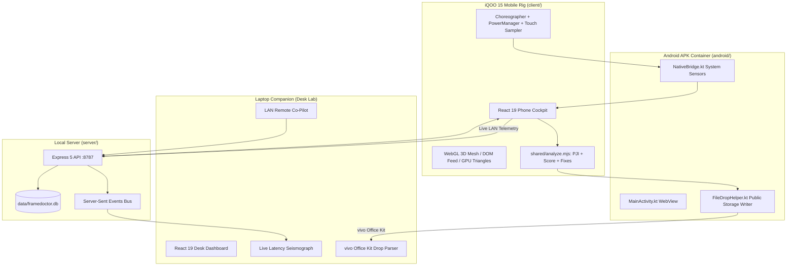

# FrameDoctor — Context & Technical Briefing for Claude

> **Instructions for Claude**:
> You are acting as our Lead Android Systems Architect and Hackathon Strategy Mentor for the **iQOO Hackathon 2026 (Chennai City Battle)**.
> Read this entire context document carefully before answering questions, generating code, or planning features. Adhere strictly to the project's locked scope, hardware constraints, and hackathon judging criteria.

---

## 1. Hackathon Overview & Rules of Engagement

* **Event**: iQOO Hackathon 2026 · Chennai City Battle
* **Dates**: 12–13 September 2026 (30-Hour Phone-First Hackathon)
* **Track**: **Developer Tools**
* **Target Hardware**: Loaner **iQOO 15**
  * SoC: Qualcomm Snapdragon 8 Elite (Oryon CPU, Adreno 830 GPU)
  * Display: 2K AMOLED, **144 Hz Refresh Rate** (Strict **6.94 ms** VSync Budget)
  * Co-Processor: Supercomputing Chip Q2
  * OS: OriginOS / FuntouchOS (Android 15 / API 35)
* **Official Judging Rubric (100% Total)**:
  1. **End Product Quality (30%)**: Rock-solid, crash-proof demo loop. No blank screens; 100% reliability.
  2. **Novelty + Impact (20%)**: The phone itself is the Device Under Test (DUT). Solves real developer pain in mobile/offline scenarios ("Red Light" phase).
  3. **Creative Phone Use (15%)**: Deep hardware telemetry (Choreographer, PowerManager, BatteryManager, 300 Hz Touch).
  4. **Technical Depth (15%)**: Real trace analysis, Peak Jitter Index (PJI), sub-millisecond p95 timing, and automated code remediation.
  5. **vivo Office Kit Usage (10%)**: Cross-device file transfer and Super Clipboard integration.
  6. **Demo / Pitch (10%)**: Crisp 90-second live demonstration (Phone $\rightarrow$ Stress $\rightarrow$ Report $\rightarrow$ Office Kit Drop).

---

## 2. Problem Statement & Solution: FrameDoctor

### The Problem
At 144 Hz, every frame has a merciless **6.94 ms deadline**. Junior developers and mobile game studios struggle with micro-stutters and thermal throttling because traditional profilers (Android Studio, Perfetto, desktop ADB) require a laptop, heavy cables, and a desk—rendering them useless on buses, in testing labs, or in offline environments. Furthermore, cloud AI debug tools cannot inspect raw hardware sensors on this SoC.

### The FrameDoctor Solution
**FrameDoctor** turns the loaner iQOO 15 into a standalone performance lab:
1. **On-Device Telemetry**: Records sub-millisecond VSync frame deltas via `Choreographer`, exact OS thermal states via `PowerManager.OnThermalStatusChangedListener`, and 300 Hz touch latency.
2. **Offline-First Analysis**: Filters startup mount spikes, computes the **Peak Jitter Index (PJI)**, detects hitch clusters, and grades the run ($0 - 100$ score).
3. **Automated Code Remediation**: Generates tailored, copy-pasteable shader patches (Adreno `mediump` float precision, `gl.FASTEST` derivative hints) and DOM layout fixes.
4. **The vivo Office Kit Ritual**: Exports reports to public storage (`Downloads`/`Documents`). Developers drag-and-drop or Super-Clipboard the report seamlessly onto their laptop companion desk in seconds.
5. **Laptop Companion Desk**: A paired web desk on LAN providing live latency seismographs, remote stress injection ("Overdraw Bomb"), and verified Office Kit drop parsing.

---

## 3. Strict Guardrails & Core Constraints

When assisting with this codebase, Claude **MUST ALWAYS** respect these boundaries:

1. **Instrument OUR Process Only**: We profile only our own instrumented workload process. Do NOT attempt to profile external games (like BGMI), root the device, use Magisk, or require ADB during the demo.
2. **Zero Cloud in Core Loop**: The core diagnostic loop MUST work 100% offline in airplane mode. Cloud LLMs (OpenAI, Gemini API) are strictly secondary or fallback; the on-device template/rule engine is the primary truth.
3. **No Layout or Alignment Breaks**: The mobile interface (`client/src/screens/Phone.jsx`) has undergone strict visual auditing. Any new buttons or elements must use absolute positioning or non-shifting flex layouts that preserve pixel alignment across phone viewports.
4. **Hardware Thermal vs. Browser Thermal**: 
   - On Android APK (`sources.thermal === "os"`): Uses real `PowerManager` thermal constants (`NONE` through `EMERGENCY`).
   - In Browser/PWA mode: Estimated heat is visual-only and does **NOT** penalize the performance score. Clean runs must score $98 - 100$ / `S — 144 Hz LOCK`.
5. **Warmup Discard**: The first 25 startup frames are discarded from steady-state statistics to prevent app launch / shader compilation spikes from polluting p95 latency.

---

## 4. Technical Architecture & Tech Stack



* **Frontend**: React 19, GSAP 3 + `@gsap/react`, React Router DOM (`HashRouter`), Vite 6.
* **Styling**: Single-source CSS (`client/src/styles.css`) with iQOO Monster Energy aesthetic (Black `#0B0B0C`, Monster Orange `#FF4D1A`, Electric Cyan `#00B4E0`, Hyper Gold `#F5C518`).
* **Backend**: Node.js Express 5, `better-sqlite3`, Server-Sent Events (SSE).
* **Native Android**: Kotlin 2.x, Target SDK 35, WebView JavaScript interface bridge.

---

## 5. Repository File Map

```text
framedoctor/
├── android/                             # Native Android Studio Project (Kotlin)
│   ├── app/src/main/
│   │   ├── AndroidManifest.xml          # Hardware permissions & acceleration
│   │   ├── assets/www/                  # Bundled Vite production build
│   │   └── java/com/framedoctor/
│   │       ├── MainActivity.kt          # WebView container & bridge registration
│   │       ├── NativeBridge.kt          # Choreographer, PowerManager, Battery interfaces
│   │       └── export/FileDropHelper.kt # Public Downloads/Documents writer for Office Kit
│   └── build.gradle.kts
│
├── client/                              # Vite + React Frontend
│   ├── src/
│   │   ├── App.jsx                      # Routes: / (Phone) and /#/desk (Desk)
│   │   ├── api.js                       # API calls & SSE subscription handler
│   │   ├── capture.js                   # Web VSync & touch sampling fallback
│   │   ├── charts.jsx                   # ScoreRing, Sparkline, Histogram, ShareCard
│   │   ├── native.js                    # Web-to-Kotlin JS interface bridge
│   │   ├── styles.css                   # Single-source design system
│   │   ├── screens/
│   │   │   ├── Phone.jsx                # Mobile DUT view (Home, Stress, Report)
│   │   │   └── Desk.jsx                 # Laptop companion desk & remote control
│   │   └── workloads/
│   │       ├── DomFeed.jsx              # DOM list layout thrash workload
│   │       └── WebGLLab.jsx             # 3D lit icosphere & triangle mesh workloads
│   └── vite.config.js
│
├── server/                              # Node.js Server
│   ├── index.mjs                        # REST endpoints & SSE event broadcaster
│   └── db.mjs                           # SQLite database manager
│
├── shared/                              # Shared Telemetry Engine
│   ├── analyze.mjs                      # Warmup filter, PJI math, scoring, code fix generator
│   └── smoke.mjs                        # Scoring & mathematical integrity test suite
│
├── scripts/
│   ├── copy-www.mjs                     # Copies client/dist to android assets/www
│   └── lab-walkthrough.mjs              # Headless Chrome E2E visual screenshot audit
│
└── package.json                         # npm run dev, test, build, build:android
```

---

## 6. Key Data Contracts & Formulas

### Telemetry JSON Structure
```json
{
  "id": "run_sample",
  "duration_s": 20.0,
  "avg_frame_ms": 6.94,
  "p95_frame_ms": 7.10,
  "pji": 0.25,
  "pji_rating": "FLAT (inside 144 Hz noise)",
  "workload": "shader3d",
  "target_hz": 144,
  "jank_frames": 0,
  "total_frames": 2880,
  "score": 100,
  "score_tier": "S — 144 Hz LOCK",
  "sources": {
    "frames": "choreographer",
    "thermal": "os",
    "battery": "os",
    "explainer": "on-device"
  },
  "fixes": [
    {
      "category": "Adreno shader precision",
      "title": "Use mediump float in fragment pass",
      "impact": "Doubles ALU throughput on Snapdragon 8 Elite",
      "code": "precision mediump float;\nvec3 light = normalize(uLightPos - vPos);"
    }
  ]
}
```

### Core Algorithms
1. **Warmup Discard Filter**:
   $$\text{frames}_{\text{steady}} = \text{frames}[25:] \quad (\text{for } N > 30)$$
2. **Peak Jitter Index (PJI)**:
   $$\text{PJI} = \sqrt{\frac{1}{N}\sum_{i=1}^{N} (\Delta t_i - \mu)^2}$$
3. **Score Calculation**:
   $$S = 100 - P_{\text{latency}} - P_{\text{jank}} - P_{\text{jitter}} - P_{\text{thermal}}$$

---

## 7. Developer Cheatsheet & Common Commands

* **Run Dev Servers (API on `:8787` + Client on `:5173`)**:
  ```bash
  npm run dev
  ```
* **Execute Telemetry Smoke Tests**:
  ```bash
  npm test
  ```
* **Build Web Client & Sync Android Assets**:
  ```bash
  npm run build:android
  ```
* **Run Headless Chrome Visual Audit**:
  ```bash
  node scripts/lab-walkthrough.mjs
  ```
* **Reset Database Before Pitch**:
  Use the `Reset Lab` button on the Desk companion header or trigger `POST /api/sessions/clear`.
