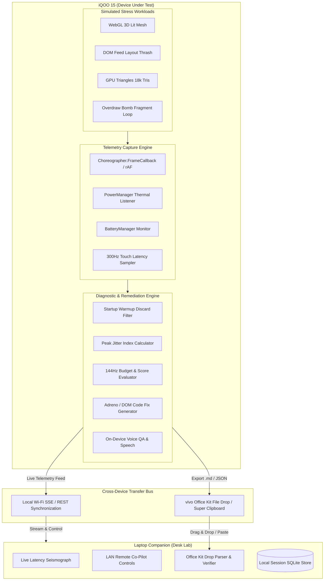

# FrameDoctor — Complete System & Implementation Documentation

**FrameDoctor** is a standalone, on-device performance diagnostic tool and cross-device developer lab built for the **iQOO 15** (Snapdragon 8 Elite, 144 Hz display, Adreno 830 GPU) for the **iQOO Hackathon · Chennai City Battle (Developer Tools Track)**.

---

## 1. Executive Summary & Core Value Proposition

| Key Dimension | Traditional Profiling (Android Studio / Perfetto) | FrameDoctor |
| :--- | :--- | :--- |
| **Physical Requirement** | Tethered USB-C cable, laptop workstation, ADB setup | Zero-tether; standalone phone-in-hand execution |
| **Operational Context** | Office desk only; fails in buses, labs, or Red Light | 100% offline, airplane-mode capable on-device rig |
| **Metric Focus** | Average FPS vanity metrics (hides micro-stutters) | **6.94 ms VSync deadline**, Peak Jitter Index (PJI), p95 latency |
| **Thermal Awareness** | Desktop profilers distort device thermals via USB charge | Native `PowerManager` thermal status monitoring |
| **Output** | Raw traces requiring hours of manual parsing | Automated, copy-pasteable shader & layout code patches |
| **Cross-Device Flow** | Manual log exports or command-line pulls | Native **vivo Office Kit** file drag & drop + Super Clipboard |

---

## 2. System Architecture & Topology



---

## 3. Implemented Components & Feature Breakdown

### 3.1 Mobile Test Rig (`client/src/screens/Phone.jsx`)

1. **Home Screen / Cockpit**:
   - **Hero Lab Header**: Displays hardware runtime origin (`APK · CHOREOGRAPHER` vs `PWA · rAF`), PowerManager status, and an absolutely positioned **`Desk Lab →`** direct switch button.
   - **Status Bar**: Real-time clock (`Asia/Kolkata`), detected device profile, and network state badge (`online` vs `airplane / offline`).
   - **Hardware Refresh Switcher**: One-tap toggle between **144 Hz (6.94 ms budget)** and **60 Hz (16.67 ms budget)**.
   - **Curated Workload Selectors**:
     - `WebGL mesh`: 3D lit icosphere with dynamic specular lighting and vertex/fragment shaders.
     - `DOM feed`: List app simulating layout thrashing, DOM mutations, and composite layer overhead.
     - `GPU triangles`: 18,000 instanced triangles taxing Adreno rasterizers.
   - **Last Session Card**: Immediate visual feedback of the most recent session's score, p95 latency, PJI, thermal state, and jank count.

2. **Real-Time Stress Testing HUD (`Stress` View)**:
   - **Dynamic Telemetry Grid**:
     - Real-time **FPS** with adaptive color grading (Green/Orange/Red).
     - Instantaneous **Frame Time (ms)** down to 0.1 ms precision.
     - **Peak Jitter Index (PJI)** indicating frame pacing stability.
     - **Thermal State / Estimated Load %** tracking hardware thermal pressure.
     - **300 Hz Touch Sampling** displaying live touch polling frequency and touch-to-frame input latency.
   - **Live Frame Histogram**: Visual rolling distribution of frame durations against the 6.94 ms budget.
   - **Hitch Flash Ring**: Visual red perimeter pulse triggering whenever any frame slips past 33.3 ms (2x 60 Hz VSync).
   - **Overdraw Bomb Injector**: Toggles massive multi-pass fragment shader loops to intentionally induce thermal stress and GPU starvation during live judging demonstrations.

3. **Diagnostic Report Screen (`Report` View)**:
   - **SVG Score Ring**: Interactive circular score dial (0–100) with animated tier classification (`S — 144 Hz LOCK`, `A — FLAGSHIP STABLE`, `B — THERMAL COMPROMISED`, `C — CRITICAL LOAD`).
   - **Top-Fold Actions**: Prominent `Save .md to Downloads` positioned immediately below the score ring for rapid handoff.
   - **2x2 Instrument Dials**: Precise readings for p95 frame time, jank ratio (`jank / total`), peak thermal status, and timestamp of first thermal throttle.
   - **Sparkline Chart**: Full frame-time timeline showing spikes relative to the target budget line.
   - **Automated Fix Engine**: Dynamic, copy-pasteable optimization code patches generated specifically for detected bottlenecks:
     - Adreno ALU precision (`precision mediump float;`).
     - Fragment shader derivative hints (`gl.hint(gl.FRAGMENT_SHADER_DERIVATIVE_HINT, gl.FASTEST)`).
     - DOM layout thrash batching (`requestAnimationFrame` read/write decoupling).
   - **On-Device Voice QA**: Offline diagnostic Q&A powered by SpeechSynthesis and intent-matching chips (*"At 15s"*, *"Thermals"*, *"Fixes"*, *"Mic"*).
   - **Multi-Format Exporters**:
     - Markdown trace (`.md`).
     - Super Clipboard payload.
     - Jira / GitHub Issue markdown.
     - Perfetto JSON trace.
     - High-resolution Shareable PNG Score Card (`charts.jsx`).

---

### 3.2 Laptop Companion Desk (`client/src/screens/Desk.jsx`)

1. **Live LAN Seismograph**:
   - Sub-second streaming canvas plotting live frame times received over LAN from the phone.
2. **Remote Co-Pilot Controls**:
   - Allows the presenter on the laptop to remotely trigger the **Overdraw Bomb**, toggle **144 Hz Budget**, or trigger **Remote Stop** on the phone.
3. **vivo Office Kit Drop Verification**:
   - Integrated clipboard and drop parsing zone (`parseOfficeKitDrop`).
   - Parses pasted markdown reports or files and displays an authenticated green verification banner:  
     `✓ vivo Office Kit Cross-Device Transfer Confirmed`.
4. **Session History Inspector**:
   - Displays all completed test runs stored in the local SQLite database.
5. **Pitch Reset Button**:
   - Header action `Reset Lab` that purges test databases with one click before demo runs.
6. **Dynamic LAN QR Code**:
   - Automatically generates a scannable QR code matching the host's Wi-Fi IP for instant phone pairing.

---

### 3.3 Native Android Integration (`android/`)

1. **`MainActivity.kt`**:
   - Android container configuring full hardware acceleration, custom WebView client, and system sensor bindings.
2. **`NativeBridge.kt`**:
   - **Choreographer Hooks**: Intercepts `Choreographer.getInstance().postFrameCallback` to provide hardware-level VSync timestamps, bypassing browser rAF inaccuracies.
   - **Thermal Monitor**: Subscribes to `PowerManager.OnThermalStatusChangedListener` to capture exact OS thermal levels (`NONE`, `LIGHT`, `MODERATE`, `SEVERE`, `CRITICAL`, `EMERGENCY`).
   - **Battery Telemetry**: Integrates with Android `BatteryManager` for real-time milliampere draw, temperature, and percentage.
   - **Tactile Haptic Feedback**: Triggers native device vibration motors on hitch events and bomb toggles.
3. **`FileDropHelper.kt`**:
   - Writes generated trace files directly to public `Environment.DIRECTORY_DOWNLOADS` and `DIRECTORY_DOCUMENTS` with proper media scan triggers, enabling **vivo Office Kit** to instantly see and drag files across devices.

---

### 3.4 Telemetry & Scoring Algorithms (`shared/analyze.mjs`)

#### 1. Startup Warmup Discard Filter
To prevent Android app launch or WebGL shader compilation spikes from distorting steady-state performance, the initial 25 startup frames are stripped from steady-state statistics:
$$\text{frames}_{\text{steady}} = \text{frames}[25:] \quad (\text{if } N > 30)$$

#### 2. Peak Jitter Index (PJI)
Quantifies frame pacing consistency by calculating the standard deviation of frame duration deltas:
$$\mu = \frac{1}{N}\sum_{i=1}^{N} \Delta t_i$$
$$\text{PJI} = \sqrt{\frac{1}{N}\sum_{i=1}^{N} (\Delta t_i - \mu)^2}$$
- $\text{PJI} \le 0.8\text{ ms}$: **FLAT (S-Tier Lock)**
- $\text{PJI} \le 2.0\text{ ms}$: **STABLE**
- $\text{PJI} > 2.0\text{ ms}$: **UNSTABLE JITTER**

#### 3. Overall Performance Score ($0 - 100$)
$$S = 100 - P_{\text{latency}} - P_{\text{jank}} - P_{\text{jitter}} - P_{\text{thermal}}$$
- **Latency Penalty ($P_{\text{latency}}$)**:
  $$P_{\text{latency}} = \max\left(0, \frac{p95 - \text{budget}}{\text{budget}} \times 40\right)$$
- **Jank Penalty ($P_{\text{jank}}$)**:
  $$P_{\text{jank}} = \left(\frac{\text{jank\_frames}}{\text{total\_frames}}\right) \times 50$$
- **Jitter Penalty ($P_{\text{jitter}}$)**:
  $$P_{\text{jitter}} = \max\left(0, (\text{PJI} - 0.8) \times 6\right)$$
- **Thermal Penalty ($P_{\text{thermal}}$)**:
  Only applied when running on native hardware (`sources.thermal == "os"`). In browser mode, estimated thermals are visual-only and do not penalize the score.

---

## 4. Complete Codebase Directory Map

```text
c:/Users/Panshul/Desktop/iqoo/framedoctor/
├── android/                             # Native Android APK Project
│   ├── app/src/main/
│   │   ├── AndroidManifest.xml          # Permissions & hardware config
│   │   └── java/com/framedoctor/
│   │       ├── MainActivity.kt          # WebView container & bridge init
│   │       ├── NativeBridge.kt          # Choreographer, PowerManager, Battery hooks
│   │       ├── capture/
│   │       │   ├── DeviceSamplers.kt    # OS thermal & battery samplers
│   │       │   └── FrameSampler.kt      # VSync timing callbacks
│   │       └── export/
│   │           └── FileDropHelper.kt    # Public directory writer for Office Kit
│   └── build.gradle.kts
│
├── client/                              # Vite + React 19 Frontend
│   ├── src/
│   │   ├── App.jsx                      # HashRouter (/#/ for Phone, /#/desk for Desk)
│   │   ├── api.js                       # HTTP client & SSE subscriber
│   │   ├── capture.js                   # Web rAF capture & touch Hz tracker
│   │   ├── charts.jsx                   # ScoreRing, Sparkline, FrameHistogram, ShareCard
│   │   ├── native.js                    # Web-to-Android JS interface bridge
│   │   ├── styles.css                   # Single-source high-tech design system
│   │   ├── screens/
│   │   │   ├── Phone.jsx                # Mobile test rig (Home, Stress, Report)
│   │   │   └── Desk.jsx                 # Laptop companion desk & remote control
│   │   └── workloads/
│   │       ├── DomFeed.jsx              # DOM list layout thrash workload
│   │       └── WebGLLab.jsx             # 3D lit icosphere & triangle mesh workloads
│   └── vite.config.js
│
├── server/                              # Node.js Express Backend
│   ├── index.mjs                        # REST API, SQLite database, SSE event bus
│   └── db.mjs                           # SQLite schema initialization
│
├── shared/                              # Shared Telemetry & Analysis Logic
│   ├── analyze.mjs                      # PJI, p95, jank, scoring & code fix rules
│   └── smoke.mjs                        # Automated unit & scoring validation tests
│
├── scripts/
│   ├── copy-www.mjs                     # Asset sync script from Vite dist to Android www
│   └── lab-walkthrough.mjs              # Headless Chrome E2E audit & screenshot generator
│
├── audit/                               # Generated visual audit screenshots
└── package.json                         # Scripts for build, test, and dev
```

---

## 5. Verification & Testing Evidence

1. **Automated Smoke Tests (`shared/smoke.mjs`)**:
   - Validates p95 calculations, jank thresholds ($> 33.3\text{ ms}$), thermal status parsing, and code fix generator isolation (DOM vs GPU fixes).
2. **Headless Chrome E2E Walkthrough (`scripts/lab-walkthrough.mjs`)**:
   - Executes the complete product loop (Home $\rightarrow$ WebGL Stress $\rightarrow$ Overdraw Bomb $\rightarrow$ Diagnostic Report $\rightarrow$ Desk Mobile & Desktop views).
   - Generates visual screenshots verifying zero layout overflow and absolute pixel alignment.
3. **Production Android Build Pipeline (`npm run build:android`)**:
   - Builds optimized Vite frontend and automatically synchronizes artifacts directly to `android/app/src/main/assets/www`.
